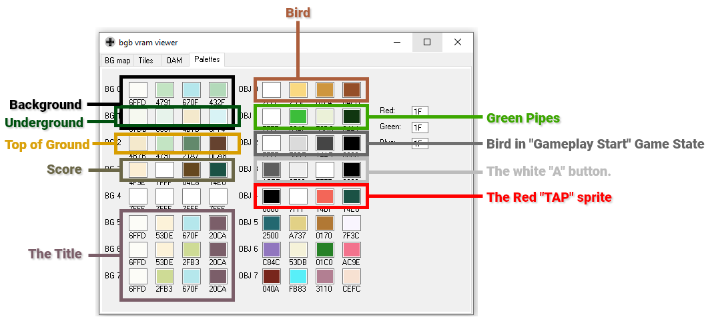

# 🧠 Neural Network Flappy Bird - Treball de Recerca

> A research project exploring reinforcement learning by training a neural network to play Flappy Bird from scratch using Godot.

## 📖 About The Project

This repository contains the **"Treball de Recerca"** (Research Project), a capstone project for high school students in Catalonia. 

**Objective:** To design, implement, and analyze a neural network capable of learning to play the game Flappy Bird without human intervention.

**Key Features:**
*   **Custom Neural Network:** Built from scratch within the Godot Engine.
*   **Genetic Algorithm:** Uses evolutionary strategies (NEAT-like approach) to train the agents.
*   **Data Analysis:** Comprehensive analysis of the learning process, generation improvements, and network topology.

## 📂 Repository Structure

The project is organized into three main sections:

### 🎮 `godot_project/`
Contains the source code for the game and the AI implementation.
*   **Engine:** Godot 4.2
*   **Key Files:** `project.godot`, `Scripts/`, `Escenes/`.

### 📊 `analysis/`
Contains the data collected during training and the scripts used to analyze it.
*   **`data/`**: Raw data from training sessions (generations, fitness scores, etc.).
*   **`scripts/`**: Python scripts used to process data and generate graphs.
*   **`plots/`**: Generated graphs visualizing the learning progress.
*   **`notes/`**: Miscellaneous notes and conclusions.

### 📝 `paper/`
Contains the written documentation and presentation materials.
*   **`TR.pdf`**: The final research paper (The "Treball de Recerca").
*   **`presentations/`**: Slides used for the oral defense.
*   **`poster/`**: Scientific poster summarizing the project.
*   **`drafts/`**: Draft versions of the paper sections.

## 🚀 Getting Started

### Running the Simulation
1.  Download [Godot Engine 4.2](https://godotengine.org/).
2.  Import the project found in `godot_project/` by selecting the `project.godot` file.
3.  Run the project to see the AI in action!

### Viewing the Analysis
The analysis scripts are located in `analysis/scripts/`. You may need Python installed with libraries like `pandas` and `matplotlib` to run them.

## 👥 Authors
*   **Teo** (and friends)

---
*Created for the Treball de Recerca requirement.*
